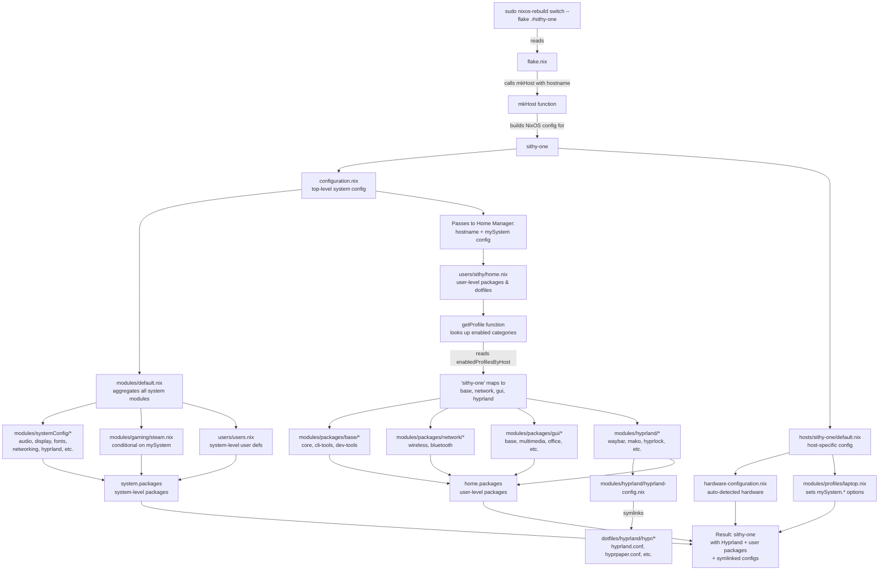

# !!AI Generated!!

# NixOS + Flakes: Multi-Host Configuration

A modular, reproducible NixOS setup for **two hosts** using Flakes + Home Manager.

- **sithy-one**: Laptop running Hyprland (window manager) with user-level packages and dotfiles
- **sithy-top**: Desktop running Plasma6 (full DE) with user-level packages

**For newcomers to NixOS/Flakes**: This repo teaches how hosts are built from modules, how custom options control behavior conditionally, how Home Manager keeps user packages separate, and why everything is reproducible.

## Quick Start

1. Fresh NixOS install (keep the generated `hardware-configuration.nix`).
2. Clone and apply:
   ```bash
   git clone https://github.com/sithypenguin/nix-config ~/Development/nix-dev/nix-config
   cd ~/Development/nix-dev/nix-config
   sudo nixos-rebuild switch --flake .#sithy-one    # or sithy-top
   ```
3. Reboot and choose your DE at login.

## What This Teaches

This repo demonstrates:
- **Flakes**: Pinning versions, defining multi-host builds, passing args to modules
- **Modules & merge order**: How `imports` works, how NixOS merges configs, why order matters
- **Custom options pattern**: Define once (`host-options.nix`), set per-host (`profiles/`), use conditionally (`lib.mkIf`)
- **Home Manager**: User packages separate from system, host-driven selection via `enabledProfilesByHost`
- **Dotfiles as code**: Hyprland configs version-controlled and symlinked declaratively
- **Why reproducible**: No scripts, no manual setup, same result on any machine

## Architecture & Design

### Key Principles

1. **Host-Driven Configuration**: Each host specifies which NixOS modules and Home Manager package categories it needs via `hostname`
2. **Home Manager First**: User packages are managed via Home Manager; system-level packages reserved for drivers, services, and core system tools
3. **Category-Based Packages**: Packages organized by purpose (base, network, gui, gaming) and imported per-host via `enabledProfilesByHost`
4. **Declarative Dotfiles**: Hyprland configuration files in `dotfiles/hyprland/` are symlinked and managed by Home Manager

### Execution Flow (Mermaid Diagram)



### Configuration Flow (Text View)

```
sudo nixos-rebuild switch --flake .#sithy-one
         ↓
    flake.nix
    ├─ mkHost { hostname = "sithy-one"; }
    │  ├─ configuration.nix
    │  │  ├─ modules/default.nix
    │  │  │  ├─ modules/systemConfig/*  (system services, audio, display, etc.)
    │  │  │  ├─ modules/gaming/steam.nix (conditional)
    │  │  │  └─ users/users.nix
    │  │  └─
    │  ├─ hosts/sithy-one/default.nix
    │  │  ├─ hardware-configuration.nix  (auto-generated)
    │  │  └─ modules/profiles/laptop.nix (sets mySystem options)
    │  │
    │  └─ Home Manager Integration
    │     └─ users/sithy/home.nix
    │        ├─ Host-driven package selection via enabledProfilesByHost
    │        ├─ modules/packages/base/*
    │        ├─ modules/packages/network/*
    │        ├─ modules/packages/gui/*
    │        ├─ modules/packages/gaming/*
    │        ├─ modules/hyprland/* (sithy-one only)
    │        └─ modules/hyprland/hyprland-config.nix (symlinks dotfiles)
    │
    └─ Result: Fully configured, reproducible system
```

### Home Manager vs. System-Level Split

#### System-Level (modules/systemConfig/, modules/gaming/)
- **Services & Daemons**: PipeWire, NetworkManager, Bluetooth, Hyprland
- **Display**: Plasma6/SDDM, Hyprland, display configuration
- **Drivers & Firmware**: GPU drivers (NVIDIA), hardware support, kernel modules
- **Fonts**: System-wide fonts (FiraCode Nerd, JetBrains Mono, Font Awesome)
- **Core Tools**: Essential CLI tools needed by system or root

#### Home Manager (modules/packages/)
- **User Packages**: All user-facing applications and development tools
- **GUI Applications**: Firefox, VSCode, Discord, VLC, etc.
- **Development**: git, direnv, language tools (if needed)
- **Utilities**: CLI tools, TUI apps, terminal emulators
- **Gaming**: Steam (user-level app; GPU drivers at system-level)
- **Dotfiles**: Hyprland config symlinks via `home.file`

This split ensures:
- Minimal system state (easier to debug, audit)
- Fast Home Manager updates (no system rebuild needed for app changes)
- Clear separation of concerns
- Each user can have different package sets

### Host-Driven Package Selection

Each host in [users/sithy/home.nix](users/sithy/home.nix) specifies which package categories to import via the `enabledProfilesByHost` map:

#### sithy-one (Hyprland)
```nix
"sithy-one" = [
  "base.core" "base.cliTools" "base.devTools"
  "network.base" "network.wireless" "network.bluetooth"
  "gui.base" "gui.multimedia" "gui.office" "gui.comms" "gui.design" "gui.tui"
];
```
Plus Hyprland-specific packages (waybar, mako, hyprlock, etc.)

#### sithy-top (Plasma6)
```nix
"sithy-top" = [
  "base.core" "base.cliTools" "base.devTools"
  "network.base" "network.wireless" "network.bluetooth"
  "gui.base" "gui.multimedia" "gui.office" "gui.comms" "gui.design" "gui.tui"
  "gaming.steam"
];
```

### Package Categories

**modules/packages/base/**
- [core.nix](modules/packages/base/core.nix) - Essential CLI: git, bat, zellij, fastfetch, kitty, zsh, ghostty
- [cli-tools.nix](modules/packages/base/cli-tools.nix) - Utilities: ncdu, btop, bmon, duf, isd, s-tui, vhs
- [dev-tools.nix](modules/packages/base/dev-tools.nix) - Development: direnv

**modules/packages/network/**
- [base.nix](modules/packages/network/base.nix) - Diagnostics: clinfo, dnsutils, nettools
- [wireless.nix](modules/packages/network/wireless.nix) - Wireless: networkmanagerapplet, iw
- [bluetooth.nix](modules/packages/network/bluetooth.nix) - Bluetooth: bluetui

**modules/packages/gui/**
- [base.nix](modules/packages/gui/base.nix) - Core: vscode, bitwarden-desktop, firefox, networkmanagerapplet
- [multimedia.nix](modules/packages/gui/multimedia.nix) - Media: vlc, spotify, pavucontrol
- [office.nix](modules/packages/gui/office.nix) - Productivity: libreoffice, obsidian, drawio
- [comms.nix](modules/packages/gui/comms.nix) - Communication: discord, telegram-desktop, element-desktop
- [design.nix](modules/packages/gui/design.nix) - Creative: prusa-slicer
- [tui.nix](modules/packages/gui/tui.nix) - Terminal UI: ncspot

**modules/packages/gaming/**
- [steam.nix](modules/packages/gaming/steam.nix) - Steam (sithy-top only)

## Understanding Flakes & NixOS: Key Concepts

### What Is a Flake?

A **Flake** is a standardized way to package a Nix project. Instead of ad-hoc scripts and implicit dependencies, a `flake.nix` file:
- **Declares inputs** (what packages/versions you need from nixpkgs)
- **Defines outputs** (what builds you produce: NixOS configs, Home Manager configs, etc.)
- **Locks versions** (flake.lock pins exact commits so rebuilds are identical)

Think of it like Cargo.lock for Rust or yarn.lock for Node.js—but for entire Linux system configurations.

### The Module System

In NixOS, everything is a **module**. A module is a function that returns a set of options and their values:

```nix
{ config, pkgs, lib, ... }:
{
  options = {
    # Define new options here
  };
  config = {
    # Set options here
  };
}
```

When you import multiple modules, NixOS **merges them together** by key. For example:

```nix
# Module A
{ services.pipewire.enable = true; }

# Module B  
{ services.pipewire.extra_settings = {...}; }

# Result after merge
{ services.pipewire = {
    enable = true;
    extra_settings = {...};
  };
}
```

**Key insight**: `imports` doesn't execute files; it **includes them in the merge**. The order of imports affects which values "win" when there are conflicts.

### Custom Options (The Pattern Used Here)

This repo uses the **options pattern** to control conditional behavior:

1. **Define** options in one file (`modules/systemConfig/host-options.nix`):
   ```nix
   options.mySystem.laptop.enable = lib.mkOption {
     type = lib.types.bool;
     default = false;
   };
   ```

2. **Set** options per-host (`modules/profiles/laptop.nix`):
   ```nix
   config.mySystem.laptop.enable = true;
   ```

3. **Use** options conditionally throughout modules:
   ```nix
   config = lib.mkIf config.mySystem.laptop.enable {
     services.pipewire.enable = true;
   };
   ```

This pattern avoids **if-then-else logic scattered everywhere** and keeps config concerns organized by role.

### Why `lib.mkIf` and `lib.mkOption`?

The `lib.mk*` functions are **merge-aware**:
- `lib.mkOption` tells NixOS "this is a defined option that can be set"
- `lib.mkIf` says "only include this config if this condition is true"
- `lib.mkDefault` sets a default that can be overridden by other modules

They exist because **merging is more complex than concatenation**. Without them, NixOS wouldn't know how to handle conflicting definitions.

### Home Manager Integration

Home Manager is a **separate NixOS module** that runs **after** the system is built. It:
1. Reads the system's final config (passed via `extraSpecialArgs`)
2. Builds user-level packages and dotfiles
3. Symlinks them to `~/.config/`, `~/.local/`, etc.
4. Runs home-manager activation scripts

**Key point**: Home Manager sees `config.mySystem` because `flake.nix` passes it via `extraSpecialArgs`. This is how `enabledProfilesByHost` in `users/sithy/home.nix` can check the hostname.

## Common Pitfalls & Misunderstandings

### "I edited a config file in `~/.config/` but it didn't persist after reboot"

**Problem**: Files in `~/.config/hyprland/` are **symlinks to the Nix store**, which is read-only. Editing them directly doesn't change the source.

**Solution**: Edit the source file in `dotfiles/hyprland/`, then rebuild Home Manager:
```bash
nano dotfiles/hyprland/hypr/hyprland.conf
home-manager switch --flake .#sithy@sithy-one
```

### "I added a package to a module but it didn't install"

**Check**:
1. Is the package category in `enabledProfilesByHost` for your host?
   - If not, add it: `"sithy-one" = [ "gui.base" /* add here */ ];`
2. Did you run the right rebuild command?
   - `home-manager switch --flake .#sithy@sithy-one` for HM changes
   - `sudo nixos-rebuild switch --flake .#sithy-one` for system changes
3. Is the package in nixpkgs?
   - Check: `nix search nixpkgs your-package-name`
   - If it doesn't exist, you may need to add custom derivations

### "Everything rebuilds when I only changed a user package"

**Problem**: You ran `sudo nixos-rebuild switch` instead of `home-manager switch`.

**Solution**: Use the right tool:
- **System changes** (PipeWire, bootloader, fonts, services): `sudo nixos-rebuild switch --flake .#sithy-one`
- **User packages only**: `home-manager switch --flake .#sithy@sithy-one` (10x faster, no sudo)
- **Dotfiles only**: `home-manager switch --flake .#sithy@sithy-one`

### "I want to use a package from nixpkgs-unstable instead of the stable channel"

**Solution**: The `flake.nix` already imports both `nixpkgs` (stable, 25.11) and `nixpkgs-unstable`. To use unstable:

```nix
# In any module
{ pkgs, ... }:
{
  home.packages = [
    inputs.nixpkgs-unstable.legacyPackages.${pkgs.system}.firefox  # unstable
    pkgs.firefox  # stable
  ];
}
```

But you need to pass `inputs` through `extraSpecialArgs` first. Check the flake.nix.

### "Why can't I just use `environment.systemPackages` for everything?"

You can, but:
- **System packages** require `sudo nixos-rebuild switch` (rebuilds kernel, services, etc.)
- **Home Manager packages** rebuild in seconds, can be done per-user
- **Mixing them** makes it hard to know what broke or what needs what

This repo keeps system packages minimal (just what the system *needs*) and user packages maximal (everything else). It's cleaner and faster.

### "I cloned this on a new host and it doesn't work"

**Check**:
1. Is the `hardware-configuration.nix` correct?
   - The installer generates this automatically; it detects your hardware
   - Don't copy one from another machine
2. Does the hostname match a host in flake.nix?
   - You get `sithy-one` and `sithy-top` only
   - To add a new host, see "Add a New Host" section below
3. Is NixOS 24.11+ installed?
   - Check: `nix --version` and `nixos-version`
   - This config uses 25.11; older versions may not work

### "Modules are 'evaluated' in a random order, how do I control when mine runs?"

**Misconception**: Modules are not evaluated in random order; they're evaluated **once all imports are collected**. NixOS builds a giant set of all option definitions, then merges them.

**You control order with**:
- `imports = [ ./other.nix ];` — include another module
- `lib.mkIf condition { ... }` — conditionally set values
- `lib.mkAfter` / `lib.mkBefore` — control merge priority for list options (rarely needed)

In practice, **order doesn't matter** because options are designed to be **order-independent** (idempotent).

### "How do I know if a module will break something?"

Test it:
```bash
nix flake check --flake .  # Evaluates without building
```

This checks if the config is syntactically valid and logically sound, without actually building the system. It's fast and safe.

## Making Changes

### System-Level Changes
```bash
# Edit system config
nano modules/systemConfig/audio.nix

# Rebuild system
sudo nixos-rebuild switch --flake .#sithy-one
```

### Home Manager Changes (Faster)
```bash
# Edit package list or user config
nano modules/packages/gui/base.nix

# Rebuild only Home Manager (no system rebuild)
home-manager switch --flake .#sithy@sithy-one
```

### Dotfile Changes
```bash
# Edit Hyprland config
nano dotfiles/hyprland/hypr/hyprland.conf

# Rebuild Home Manager to symlink changes
home-manager switch --flake .#sithy@sithy-one
```

**Important:** Files in `~/.config/` are **read-only symlinks** to the Nix store. Always edit the source files in `dotfiles/hyprland/`.

### Cleaning Up

```bash
# Delete old Home Manager generations (keep last 5 days)
home-manager expire-generations "-5 days"

# Delete old system generations (keep last 3)
sudo nix-env --delete-generations +3 --profile /nix/var/nix/profiles/system

# Clean up Nix store
nix-collect-garbage -d
sudo nix-collect-garbage -d
```

## Directory Structure

```
nix-config/
├── flake.nix                    # Entry point, mkHost function, nixosConfigurations
├── flake.lock                   # Pinned package versions
├── README.md                    # This file
│
├── configuration.nix            # Main system config, imports modules/
│
├── assets/
│   └── wlogout/                 # SVG icons for wlogout power menu
│
├── dotfiles/
│   └── hyprland/                # Hyprland config files (symlinked by HM)
│       ├── hypr/
│       │   ├── hyprland.conf
│       │   ├── hyprpaper.conf
│       │   ├── hyprlock.conf
│       │   └── hypridle.conf
│       ├── waybar/
│       │   ├── config.json
│       │   └── style.css
│       ├── wlogout/
│       │   ├── layout
│       │   └── style.css
│       ├── mako/
│       │   └── config
│       ├── kitty/
│       │   └── kitty.conf
│       └── rofi/
│           └── config.rasi
│
├── hosts/
│   ├── sithy-one/
│   │   ├── default.nix
│   │   └── hardware-configuration.nix
│   └── sithy-top/
│       ├── default.nix
│       └── hardware-configuration.nix
│
├── modules/
│   ├── default.nix              # Aggregates all system modules
│   │
│   ├── systemConfig/            # System-level configuration
│   │   ├── host-options.nix     # Defines mySystem option structure
│   │   ├── fonts.nix            # System-wide fonts
│   │   ├── audio.nix            # PipeWire setup
│   │   ├── bluetooth.nix        # Bluetooth hardware
│   │   ├── display.nix          # Display/DE/SDDM
│   │   ├── networking.nix       # NetworkManager
│   │   ├── hyprland.nix         # Hyprland system-level
│   │   ├── sysConfig.nix        # Bootloader, locale, timezone, etc.
│   │   └── zsh.nix              # Zsh system config
│   │
│   ├── hyprland/                # Hyprland-specific modules
│   │   ├── hyprland.nix         # User packages (waybar, mako, hyprlock, etc.)
│   │   ├── hyprland-config.nix  # Dotfile symlinks
│   │   └── cachix.nix           # Binary cache for faster builds
│   │
│   ├── gaming/
│   │   └── steam.nix            # System-level Steam setup
│   │
│   ├── packages/                # Home Manager package categories
│   │   ├── base/
│   │   │   ├── core.nix
│   │   │   ├── cli-tools.nix
│   │   │   └── dev-tools.nix
│   │   ├── network/
│   │   │   ├── base.nix
│   │   │   ├── wireless.nix
│   │   │   └── bluetooth.nix
│   │   ├── gui/
│   │   │   ├── base.nix
│   │   │   ├── multimedia.nix
│   │   │   ├── office.nix
│   │   │   ├── comms.nix
│   │   │   ├── design.nix
│   │   │   └── tui.nix
│   │   ├── gaming/
│   │   │   └── steam.nix
│   │   ├── sys-util-packages.nix    # OBSOLETE (see base/)
│   │   ├── gui-packages.nix         # OBSOLETE (see gui/)
│   │   └── tui-packages.nix         # OBSOLETE (see gui/tui.nix)
│   │
│   └── profiles/                # System option presets per role
│       ├── laptop.nix           # Sets mySystem.* for laptop
│       └── desktop.nix          # (placeholder for future desktop profile)
│
├── users/
│   ├── users.nix                # System user definitions
│   └── sithy/
│       └── home.nix             # Home Manager user config
│           ├── Defines enabledProfilesByHost
│           └── Imports category modules based on hostname
│
└── docs/                        # Learning examples (not used by configuration)
    ├── EXECUTION-FLOW.md
    ├── QUICK-REFERENCE.md
    ├── TROUBLESHOOTING.md
    └── examples/
        ├── 01-minimal-single-host/
        ├── 02-with-modules/
        ├── 03-with-options/
        └── 04-multi-host/
```

## What Makes This Reproducible

1. **Flake lock** pins exact nixpkgs versions
2. **Declarative only** - Everything in `.nix` files, no imperative steps
3. **Dotfiles in repo** - Hyprland configs are version-controlled
4. **No manual setup** - One command rebuilds everything
5. **Hardware detection only** - Only `hardware-configuration.nix` is machine-specific

## Configuration Options

The system uses custom NixOS options (`mySystem.*`) to control conditional behavior:

### Current Options (modules/systemConfig/host-options.nix)
- `mySystem.laptop.enable` - Enables laptop-specific features (display, touchpad, power management)
- `mySystem.laptop.environment` - `"hyprland"` or `"plasma6"`
- `mySystem.hardware.bluetooth` - Enable Bluetooth support
- `mySystem.shell.zsh` - Enable Zsh as default shell
- `mySystem.gaming.steam` - Enable Steam at system level (sithy-top)
- `mySystem.gaming.enable`, `mySystem.development.enable` - Reserved for future use

### Conditional Module Activation

Modules use `lib.mkIf` to check these options and activate accordingly:

```nix
# Example: Audio only activates for laptops
config = lib.mkIf config.mySystem.laptop.enable {
  services.pipewire.enable = true;
};
```

## Customization Examples

### Add a New Package to All Hosts
Edit the category module (e.g., [modules/packages/gui/base.nix](modules/packages/gui/base.nix)):
```nix
home.packages = with pkgs; [
  firefox
  your-new-package  # ← Add here
  ...
];
```

### Add a Package to Only One Host
Edit [users/sithy/home.nix](users/sithy/home.nix) and add a new host-specific category, or modify `enabledProfilesByHost` selectively.

### Change Hyprland Config
Edit [dotfiles/hyprland/hypr/hyprland.conf](dotfiles/hyprland/hypr/hyprland.conf), then:
```bash
home-manager switch --flake .#sithy@sithy-one
```

### Add a New Host
1. `mkdir -p hosts/your-hostname`
2. Generate hardware config: `nixos-generate-config --show-hardware-config > hosts/your-hostname/hardware-configuration.nix`
3. Create [hosts/your-hostname/default.nix](hosts/your-hostname/default.nix):
   ```nix
   { config, pkgs, ... }:
   {
     imports = [
       ./hardware-configuration.nix
       ../../modules/profiles/laptop.nix  # or desktop.nix
     ];
     networking.hostName = "your-hostname";
   }
   ```
4. Add to [flake.nix](flake.nix): `your-hostname = mkHost { hostname = "your-hostname"; };`
5. Add to [users/sithy/home.nix](users/sithy/home.nix) enabledProfilesByHost:
   ```nix
   "your-hostname" = [ "base.core" /* ... */ ];
   ```
6. Rebuild:
   ```bash
   sudo nixos-rebuild switch --flake .#your-hostname
   ```

## Learning Resources & Study Path

### For Complete Newcomers to NixOS/Flakes

Start here if this is your first exposure to declarative Linux configs:

1. **Understand the philosophy**: Read [What is Nix?](https://www.tweag.io/blog/2022-07-04-what-is-nix/) (5 min)
2. **See how modules work**: [NixOS Modules Explained](https://nixos.wiki/wiki/Modules) (10 min)
3. **Learn about Flakes**: [Flakes Introduction](https://nixos.wiki/wiki/Flakes) (15 min)
4. **Try the examples**: Work through `docs/examples/01-minimal-single-host/` → `04-multi-host/` in order

### Progressive Examples in This Repo

The `docs/examples/` directory contains **standalone, self-contained** configs you can study:

- [01-minimal-single-host](docs/examples/01-minimal-single-host/) — Simplest flake+NixOS combo; no modules, no Home Manager
- [02-with-modules](docs/examples/02-with-modules/) — Single host with modules; teaches how `imports` merges configs
- [03-with-options](docs/examples/03-with-options/) — Custom options + `lib.mkIf`; shows the pattern used in the main config
- [04-multi-host](docs/examples/04-multi-host/) — Multiple hosts with `mkHost` helper; closest to this repo's architecture

**Study tip**: Copy each example directory to a test machine and run `nix flake check` and `nix flake show` to understand the structure before building.

### Understanding This Repo's Codebase

Read the files in this order (they build conceptually):

1. [flake.nix](flake.nix) — Entry point; defines inputs (nixpkgs versions), `mkHost` helper, outputs (configs for each host)
2. [modules/systemConfig/host-options.nix](modules/systemConfig/host-options.nix) — Option definitions; defines `mySystem.*` namespace
3. [modules/profiles/laptop.nix](modules/profiles/laptop.nix) and [desktop.nix](modules/profiles/desktop.nix) — Where `mySystem.*` are set per-role
4. [configuration.nix](configuration.nix) — Top-level; imports all system modules
5. [hosts/sithy-one/default.nix](hosts/sithy-one/default.nix) — Host-specific: hardware + profile
6. [users/sithy/home.nix](users/sithy/home.nix) — Home Manager; defines `enabledProfilesByHost` and `getProfile` function

### External Documentation

- **[NixOS Manual](https://nixos.org/manual/nixos/stable/)** — Official reference (dense, but authoritative)
- **[Home Manager Manual](https://nix-community.github.io/home-manager/)** — User-level packages and dotfiles
- **[Nix Pills](https://nixos.org/guides/nix-pills/)** — Tutorial series on how Nix works from first principles
- **[Hyprland Wiki](https://wiki.hyprland.org/)** — For window manager-specific config
- **[NixOS Search](https://search.nixos.org/)** — Find packages and options

### Debugging Tips

**"I don't understand how X works"**:
1. Look at `docs/examples/` first — they're simpler
2. Run `nix flake show` to see what outputs are defined
3. Run `nix eval` to inspect values: `nix eval --flake . --raw '#nixosConfigurations.sithy-one.config.mySystem'`
4. Check the NixOS manual for the specific option you're confused about

**"The build failed with error X"**:
1. Run `nix flake check` first to catch evaluation errors early
2. Search the error message in [NixOS Discourse](https://discourse.nixos.org/)
3. Verify your `hardware-configuration.nix` is correct (run `nixos-generate-config` on the actual machine)

## License

This configuration is provided as-is for educational and personal use.


