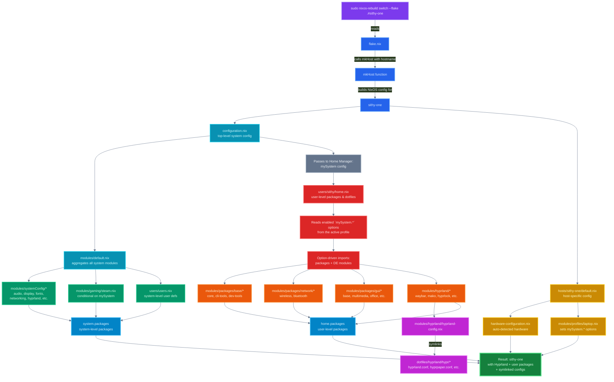

# !!AI Generated!!

# NixOS + Flakes: Multi-Host Configuration

A modular, reproducible NixOS setup for **two hosts** using Flakes + Home Manager.

- **sithy-one**: Laptop running Hyprland (window manager) with user-level packages and dotfiles
- **sithy-top**: Desktop running Plasma6 (full DE) with user-level packages

**For newcomers to NixOS/Flakes**: This repo teaches how hosts are built from modules, how custom options control behavior conditionally, how Home Manager keeps user packages separate, and why everything is reproducible.

## Quick Start

1. Fresh NixOS install (keep the generated `hardware-configuration.nix`).
2. Clone and apply:
   ```bash
   git clone https://github.com/sithypenguin/nix-config ~/Development/nix-dev/nix-config
   cd ~/Development/nix-dev/nix-config
   sudo nixos-rebuild switch --flake .#sithy-one    # or sithy-top
   ```
3. Reboot and choose your DE at login.

## What This Teaches

This repo demonstrates:
- **Flakes**: Pinning versions, defining multi-host builds, passing args to modules
- **Modules & merge order**: How `imports` works, how NixOS merges configs, why order matters
- **Custom options pattern**: Define once (`host-options.nix`), set per-host (`profiles/`), use conditionally (`lib.mkIf`)
- **Home Manager**: User packages separate from system, imported from `mySystem.packages.*` and DE options
- **Dotfiles as code**: Hyprland configs version-controlled and symlinked declaratively
- **Why reproducible**: No scripts, no manual setup, same result on any machine

## Architecture & Design

### Key Principles

1. **Policy-Driven Configuration**: Each host imports a role/profile, and that profile sets `mySystem.*` options that control both system and user features
2. **Home Manager First**: User packages are managed via Home Manager; system-level packages reserved for drivers, services, and core system tools
3. **Category-Based Packages**: Packages are organized by purpose (base, network, gui, gaming) and imported when the corresponding `mySystem.packages.*` option is enabled
4. **Declarative Dotfiles**: Hyprland configuration files in `dotfiles/hyprland/` are symlinked and managed by Home Manager

### Execution Flow (Mermaid Diagram)


```mermaid
%%{init: {'theme':'base', 'themeVariables': {
  'primaryColor':'#1e293b',
  'primaryTextColor':'#e2e8f0',
  'primaryBorderColor':'#475569',
  'lineColor':'#64748b',
  'fontSize':'13px',
  'fontFamily':'monospace'
}}}%%
graph TD
    A["sudo nixos-rebuild switch --flake .#sithy-one"]:::command -->|reads| B["flake.nix"]:::flake
    B -->|calls mkHost with hostname| C["mkHost function"]:::flake
    C -->|builds NixOS config for| D["sithy-one"]:::flake
    
    D --> E["configuration.nix<br/>top-level system config"]:::sysConfig
    E --> F["modules/default.nix<br/>aggregates all system modules"]:::sysConfig
    F --> G["modules/systemConfig/*<br/>audio, display, fonts,<br/>networking, hyprland, etc."]:::sysModules
    F --> H["modules/gaming/steam.nix<br/>conditional on mySystem"]:::sysModules
    F --> I["users/users.nix<br/>system-level user defs"]:::sysModules
    
    D --> J["hosts/sithy-one/default.nix<br/>host-specific config"]:::hostFiles
    J --> K["hardware-configuration.nix<br/>auto-detected hardware"]:::hostFiles
    J --> L["modules/profiles/laptop.nix<br/>sets mySystem.* options"]:::hostFiles
    
   E --> M["Passes to Home Manager:<br/>mySystem config"]:::bridge
    M --> N["users/sithy/home.nix<br/>user-level packages & dotfiles"]:::hmConfig
   N --> O["Reads enabled `mySystem.*` options<br/>from the active profile"]:::hmConfig
   O --> P["Option-driven imports:<br/>packages + DE modules"]:::hmConfig
   P --> Q["modules/packages/base/*<br/>core, cli-tools, dev-tools"]:::packages
   P --> R["modules/packages/network/*<br/>wireless, bluetooth"]:::packages
   P --> S["modules/packages/gui/*<br/>base, multimedia, office, etc."]:::packages
   P --> T["modules/hyprland/*<br/>waybar, mako, hyprlock, etc."]:::packages
    
    T --> U["modules/hyprland/hyprland-config.nix"]:::dotfiles
    U -->|symlinks| V["dotfiles/hyprland/hypr/*<br/>hyprland.conf, hyprpaper.conf, etc."]:::dotfiles
    
    Q --> W["home.packages<br/>user-level packages"]:::output
    R --> W
    S --> W
    T --> W
    
    G --> X["system.packages<br/>system-level packages"]:::output
    H --> X
    I --> X
    
    W --> Y["Result: sithy-one<br/>with Hyprland + user packages<br/>+ symlinked configs"]:::final
    X --> Y
    L --> Y
    K --> Y
    
    classDef command fill:#7c3aed,stroke:#a78bfa,stroke-width:2px,color:#f3e8ff
    classDef flake fill:#2563eb,stroke:#60a5fa,stroke-width:2px,color:#dbeafe
    classDef sysConfig fill:#0891b2,stroke:#22d3ee,stroke-width:2px,color:#cffafe
    classDef sysModules fill:#059669,stroke:#34d399,stroke-width:2px,color:#d1fae5
    classDef hostFiles fill:#ca8a04,stroke:#facc15,stroke-width:2px,color:#fef9c3
    classDef bridge fill:#64748b,stroke:#94a3b8,stroke-width:2px,color:#f1f5f9
    classDef hmConfig fill:#dc2626,stroke:#f87171,stroke-width:2px,color:#fee2e2
    classDef packages fill:#ea580c,stroke:#fb923c,stroke-width:2px,color:#ffedd5
    classDef dotfiles fill:#c026d3,stroke:#e879f9,stroke-width:2px,color:#fae8ff
    classDef output fill:#0284c7,stroke:#38bdf8,stroke-width:2px,color:#e0f2fe
    classDef final fill:#15803d,stroke:#4ade80,stroke-width:3px,color:#dcfce7
```


**Color coding for clarity:**
- **Purple** - Entry command
- **Blue** - Flake infrastructure (entry point files)
- **Cyan** - System configuration core
- **Green** - System modules & services
- **Yellow** - Host-specific files (hardware, profiles)
- **Gray** - Bridge/transition to Home Manager
- **Red** - Home Manager configuration logic
- **Orange** - User package modules
- **Magenta** - Dotfile symlinks
- **Sky Blue** - Merged outputs
- **Bright Green** - Final result

Each color represents a distinct functional area, making it easy to trace the flow from command → flake → system config → host config → Home Manager → packages → result.

### Configuration Flow (Text View)

```
sudo nixos-rebuild switch --flake .#sithy-one
         ↓
    flake.nix
    ├─ mkHost { hostname = "sithy-one"; }
    │  ├─ configuration.nix
    │  │  ├─ modules/default.nix
    │  │  │  ├─ modules/systemConfig/*  (system services, audio, display, etc.)
    │  │  │  ├─ modules/gaming/steam.nix (conditional)
    │  │  │  └─ users/users.nix
    │  │  └─
    │  ├─ hosts/sithy-one/default.nix
    │  │  ├─ hardware-configuration.nix  (auto-generated)
    │  │  └─ modules/profiles/laptop.nix (sets mySystem options)
    │  │
    │  └─ Home Manager Integration
    │     └─ users/sithy/home.nix
   │        ├─ Option-driven package selection via mySystem.packages.*
    │        ├─ modules/packages/base/*
    │        ├─ modules/packages/network/*
    │        ├─ modules/packages/gui/*
    │        ├─ modules/packages/gaming/*
    │        ├─ modules/hyprland/* (sithy-one only)
    │        └─ modules/hyprland/hyprland-config.nix (symlinks dotfiles)
    │
    └─ Result: Fully configured, reproducible system
```

### Home Manager vs. System-Level Split

#### System-Level (modules/systemConfig/, modules/gaming/)
- **Services & Daemons**: PipeWire, NetworkManager, Bluetooth, KDE Connect, Hyprland
- **Display**: Plasma6/SDDM, Hyprland, display configuration
- **Drivers & Firmware**: GPU drivers (NVIDIA), hardware support, kernel modules
- **Fonts**: System-wide fonts (FiraCode Nerd, JetBrains Mono, Font Awesome)
- **Core Tools**: Essential CLI tools needed by system or root

#### Home Manager (modules/packages/)
- **User Packages**: All user-facing applications and development tools
- **GUI Applications**: Firefox, VSCode, Discord, VLC, etc.
- **Development**: git, direnv, language tools (if needed)
- **Utilities**: CLI tools, TUI apps, terminal emulators
- **Gaming**: Optional user-level packages layered on top of system Steam support
- **Dotfiles**: Hyprland config symlinks via `home.file`

This split ensures:
- Minimal system state (easier to debug, audit)
- Clear separation between system services and user-facing packages
- One rebuild path for this flake (`nixos-rebuild`), because Home Manager is integrated as a NixOS module
- Clear separation of concerns
- Each user can have different package sets

### Policy-Driven Package Selection

Profiles enable package categories and desktop-environment modules by setting `mySystem.*` options. [users/sithy/home.nix](users/sithy/home.nix) imports package modules when those options are true.

#### sithy-one (Hyprland)
```nix
mySystem = {
   packages.base.core = true;
   packages.base.cliTools = true;
   packages.base.devTools = true;
   packages.network.base = true;
   packages.network.wireless = true;
   packages.network.bluetooth = true;
   packages.gui.base = true;
   packages.gui.multimedia = true;
   packages.gui.office = true;
   packages.gui.comms = true;
   packages.gui.design = true;
   packages.gui.tui = true;
   packages.gaming.steam = true;
   packages.development.godot = true;

   environment = "hyprland";
};
```
That imports the base/network/gui package modules plus Hyprland-specific packages and dotfiles.

#### sithy-top (Plasma6)
```nix
mySystem = {
   packages.base.core = true;
   packages.base.cliTools = true;
   packages.base.devTools = true;
   packages.network.base = true;
   packages.network.wireless = true;
   packages.network.bluetooth = true;
   packages.gui.base = true;
   packages.gui.multimedia = true;
   packages.gui.office = true;
   packages.gui.comms = true;
   packages.gui.design = true;
   packages.gui.tui = true;
   packages.gaming.steam = true;
   packages.development.godot = true;

   environment = "plasma6";
};
```

### Package Categories

**modules/packages/base/**
- [core.nix](modules/packages/base/core.nix) - Essential CLI: git, bat, zellij, fastfetch, kitty, zsh, ghostty
- [cli-tools.nix](modules/packages/base/cli-tools.nix) - Utilities: ncdu, btop, bmon, duf, isd, s-tui, vhs, superfile, pciutils, nvtop
- [dev-tools.nix](modules/packages/base/dev-tools.nix) - Development: direnv, pkg-config

**modules/packages/network/**
- [base.nix](modules/packages/network/base.nix) - Diagnostics: clinfo, dnsutils, nettools
- [wireless.nix](modules/packages/network/wireless.nix) - Wireless: networkmanagerapplet, iw
- [bluetooth.nix](modules/packages/network/bluetooth.nix) - Bluetooth: bluetui

**modules/packages/gui/**
- [base.nix](modules/packages/gui/base.nix) - Core: vscode, bitwarden-desktop, firefox, networkmanagerapplet, easyeffects, chromium, microsoft-edge
- [multimedia.nix](modules/packages/gui/multimedia.nix) - Media: vlc, spotify
- [office.nix](modules/packages/gui/office.nix) - Productivity: libreoffice, obsidian, drawio
- [comms.nix](modules/packages/gui/comms.nix) - Communication: discord, telegram-desktop, element-desktop, kdeconnect-kde
- [design.nix](modules/packages/gui/design.nix) - Creative: prusa-slicer
- [tui.nix](modules/packages/gui/tui.nix) - Terminal UI: ncspot

**modules/packages/gaming/**
- [steam.nix](modules/packages/gaming/steam.nix) - Steam user package (enabled only for `sithy-top`; system Steam support is enabled via `mySystem.gaming.steam`)

## Key Concepts for Beginners

If you're new to NixOS or Flakes, this section explains the fundamental concepts used in this repo. Familiarity with these will make the "Detailed Task Examples" section much clearer.

### What Is a Flake?

A **Flake** is a standardized way to package a Nix project. Instead of ad-hoc scripts and implicit dependencies, a `flake.nix` file:
- **Declares inputs** — What packages/versions you need from nixpkgs (think `package.json` dependencies)
- **Defines outputs** — What builds you produce: NixOS configs, Home Manager configs, etc.
- **Locks versions** — `flake.lock` pins exact commits so rebuilds are identical anywhere (like `yarn.lock`)

**Example flow**:
```
User runs: sudo nixos-rebuild switch --flake .#sithy-one
         ↓
Nix reads: flake.nix and flake.lock
         ↓
Finds output: nixosConfigurations.sithy-one
         ↓
Builds system with those exact pinned versions
```

**Why this matters**: Everyone who clones your repo and runs `sudo nixos-rebuild switch --flake .#sithy-one` gets *identical* results, down to package versions. No "it works on my machine" problems.

### The Module System

In NixOS, everything is a **module**. A module is a function that returns a set of options and their values. Think of it like a config file format that's also executable code:

```nix
{ config, pkgs, lib, ... }:
{
  options = {
    # Define new options here (what can be configured)
  };
  config = {
    # Set options here (what the actual values are)
  };
}
```

When you `import` multiple modules, NixOS **merges them together** automatically. For example:

```nix
# Module A (modules/systemConfig/audio.nix)
{ services.pipewire.enable = true; }

# Module B (modules/systemConfig/display.nix)
{ services.pipewire.extra_settings = {...}; }

# After NixOS merges them:
{ 
  services.pipewire = {
    enable = true;
    extra_settings = {...};
  };
}
```

**Key insight**: `imports` doesn't just load files; it **merges their configs together**. This is how multiple files can define different parts of the same service without conflicts.

### Custom Options: The `mySystem.*` Pattern

This repo uses the **options pattern** to control conditional behavior per-host. Instead of scattering `if-then-else` throughout modules, we:

1. **Define** options once (`modules/systemConfig/host-options.nix`):
   ```nix
   options.mySystem.laptop.enable = lib.mkOption {
     type = lib.types.bool;
     default = false;
     description = "Enable laptop-specific configuration";
   };
   ```

2. **Set** option values per-host (`modules/profiles/laptop.nix`):
   ```nix
   config.mySystem.laptop.enable = true;
   config.mySystem.environment = "hyprland";
   ```

3. **Use** options conditionally in any module:
   ```nix
   config = lib.mkIf config.mySystem.laptop.enable {
     services.pipewire.enable = true;
   };
   ```

**Why this is better than ad-hoc conditionals**: All option definitions are in one place (host-options.nix), all values per-host are in one place (profiles/laptop.nix), and modules just reference them. If you need to add a new option, you add it to one file, not scattered throughout 5 files.

### Home Manager: User Packages & Dotfiles

Home Manager is a **NixOS module** that builds user-level configuration. Unlike system packages (which require `sudo`), Home Manager manages:
- User packages (Firefox, VSCode, CLI tools)
- Dotfiles (symlinked from `~/.config/` to the Nix store)
- User services and programs

**How it integrates in this repo**:
1. The `flake.nix` passes the system's `mySystem` config to Home Manager via `extraSpecialArgs`
2. `users/sithy/home.nix` reads `mySystem` options from the active profile
3. Home Manager conditionally imports package groups and Hyprland modules from those options
4. All changes still go through `sudo nixos-rebuild` (because Home Manager is a NixOS module here)

**Key difference from stand-alone Home Manager**:
- Typical Home Manager: Run `home-manager switch` separately from `nixos-rebuild`
- This repo: Everything is one flake; run `sudo nixos-rebuild switch` and it handles both system + Home Manager

### Why `lib.mkIf`, `lib.mkOption`, and Friends?

The `lib.mk*` functions are **merge-aware primitives**:
- `lib.mkOption` declares "this option exists and can be configured"
- `lib.mkIf condition { ... }` includes config only if `condition` is true
- `lib.mkDefault value` sets a default that other modules can override
- `lib.mkAfter` / `lib.mkBefore` control merge order for lists

They exist because **merging is more complex than just concatenating files**. Without them, NixOS wouldn't know:
- What happens if two modules set the same option to different values?
- Should a value be included or not?
- In what order should list items appear?

These functions answer those questions and make configs deterministic.

## Making Changes to Your Configuration

All changes flow through `nixos-rebuild`:

```bash
# Make an edit to any config file (system, packages, or dotfiles)
nano modules/systemConfig/audio.nix         # System service
nano modules/packages/gui/base.nix          # User package
nano dotfiles/hyprland/hypr/hyprland.conf  # Dotfile

# Rebuild and apply changes
sudo nixos-rebuild switch --flake .#sithy-one
```

**Key principle**: Whether you edit system config, user packages, or dotfiles, use the same rebuild command. This is because Home Manager is integrated as a NixOS module in this flake.

### Editing Dotfiles Safely

Important: Files in `~/.config/` and `~/.local/` are **read-only symlinks to the Nix store**. Editing them directly won't persist after reboot.

```bash
# ❌ Wrong: Edits won't persist
nano ~/.config/hypr/hyprland.conf

# ✅ Correct: Edit the source, then rebuild
nano dotfiles/hyprland/hypr/hyprland.conf
sudo nixos-rebuild switch --flake .#sithy-one
```

## Detailed Task Examples

This section provides step-by-step examples for common tasks with copy-paste ready code.

### Task 1: Add a User Package (to One or All Hosts)

**Problem**: You want to install a GUI app or CLI tool for your user. Example: adding `htop` (system monitor).

**Solution**:

1. **Find the right package module**. User packages are organized by purpose in `modules/packages/`:
   - `base/core.nix` — Essential CLI (git, kitty, zsh, bat)
   - `base/cli-tools.nix` — Utilities (htop, ncdu, btop, etc.)
   - `base/dev-tools.nix` — Development (direnv, pkg-config)
   - `gui/base.nix` — Core GUI apps (Firefox, VSCode, etc.)
   - `gui/multimedia.nix` — Media (VLC, Spotify)
   - `gui/office.nix` — Productivity (LibreOffice, Obsidian)
   - `gui/comms.nix` — Communication (Discord, Telegram)
   - `gui/design.nix` — Creative (Prusa Slicer)
   - `network/*` — Network tools

2. **Edit the module** and add your package:

   **Before** (`modules/packages/base/cli-tools.nix`):
   ```nix
   { config, pkgs, ... }:
   {
     home.packages = with pkgs; [
       ncdu
       btop
       bmon
       duf
     ];
   }
   ```

   **After** (added `htop`):
   ```nix
   { config, pkgs, ... }:
   {
     home.packages = with pkgs; [
       ncdu
       btop
       bmon
       duf
       htop  # ← Add here
     ];
   }
   ```

3. **Verify the package exists** in nixpkgs:
   ```bash
   nix search nixpkgs htop
   ```

4. **Rebuild** your host:
   ```bash
   sudo nixos-rebuild switch --flake .#sithy-one
   ```

5. **Verify** the package installed:
   ```bash
   which htop
   ```

**What can break**:
- Package doesn't exist in nixpkgs — search first with `nix search nixpkgs`
- Forgot to rebuild — packages only appear after rebuild, not immediately
- Package is from unstable, but you're on stable — use `pkgs-unstable.package-name` (most modules already receive `pkgs-unstable`)
- The package category is not enabled in your profile — check the relevant `mySystem.packages.*` option in `modules/profiles/`

**For only one host**: Enable the package category only in that host's profile:
```nix
mySystem = {
   packages.gui.base = true;
   # Leave the same option false on other profiles
};
```

---

### Task 2: Add a System Package or Service (e.g., Enable Bluetooth)

**Problem**: You want to enable a system-level service or driver that all users need. Example: enabling Bluetooth support.

**Solution**:

1. **Check if it already exists** in `modules/systemConfig/`:
   ```bash
   ls modules/systemConfig/
   # Look for: audio.nix, bluetooth.nix, display.nix, networking.nix, etc.
   ```

2. **If the service module exists**, check if it's conditional:

   **modules/systemConfig/bluetooth.nix**:
   ```nix
   { config, pkgs, lib, ... }:
   {
     config = lib.mkIf config.mySystem.hardware.bluetooth {
       # Bluetooth configuration here
     };
   }
   ```

3. **Enable it in your host's profile**:

   **Before** (`modules/profiles/laptop.nix`):
   ```nix
   { ... }:
   {
     mySystem = {
       laptop.enable = true;
       laptop.environment = "hyprland";
       hardware.bluetooth = false;  # ← Currently disabled
     };
   }
   ```

   **After** (enabled):
   ```nix
   { ... }:
   {
     mySystem = {
       laptop.enable = true;
       laptop.environment = "hyprland";
       hardware.bluetooth = true;  # ← Now enabled
     };
   }
   ```

4. **Rebuild**:
   ```bash
   sudo nixos-rebuild switch --flake .#sithy-one
   ```

5. **Verify**:
   ```bash
   # Check if Bluetooth service is running
   systemctl status bluetooth
   ```

**If the service doesn't exist**, create a new module:

1. **Create** `modules/systemConfig/my-service.nix`:
   ```nix
   { config, pkgs, lib, ... }:
   {
     config = lib.mkIf config.mySystem.myNewOption {
       services.my-service = {
         enable = true;
         # Your configuration here
       };
     };
   }
   ```

2. **Add the option** to `modules/systemConfig/host-options.nix`:
   ```nix
   options.mySystem.myNewOption = lib.mkEnableOption "my-service";
   ```

3. **Import the module** in `modules/default.nix`:
   ```nix
   imports = [
     ./systemConfig/host-options.nix
     ./systemConfig/audio.nix
     ./systemConfig/bluetooth.nix
     ./systemConfig/my-service.nix  # ← Add here
   ];
   ```

4. **Enable in a profile** (`modules/profiles/laptop.nix`):
   ```nix
   mySystem.myNewOption = true;
   ```

5. **Rebuild**:
   ```bash
   sudo nixos-rebuild switch --flake .#sithy-one
   ```

**What can break**:
- Forgot to add the option to `host-options.nix` — modules won't find `config.mySystem.myNewOption`
- Forgot to import the module in `modules/default.nix` — the module won't run
- Service dependency missing — some services depend on others (e.g., Bluetooth needs kernel support)
- Invalid NixOS service option — check the NixOS manual: `man configuration.nix` or [NixOS search](https://search.nixos.org/options)

---

### Task 3: Add a New Host (e.g., sithy-three)

**Problem**: You have another machine (laptop, desktop, server) and want to add it to this flake.

**Solution**:

1. **On the new machine, generate hardware config**:
   ```bash
   nixos-generate-config --show-hardware-config > hardware-configuration.nix
   ```

2. **Create the host directory** on your workstation:
   ```bash
   mkdir -p hosts/sithy-three
   # Copy the hardware config you generated
   cp hardware-configuration.nix hosts/sithy-three/
   ```

3. **Create** `hosts/sithy-three/default.nix`:
   ```nix
   { config, pkgs, ... }:
   {
     imports = [
       ./hardware-configuration.nix
       ../../modules/profiles/laptop.nix  # or desktop.nix
     ];

     networking.hostName = "sithy-three";
   }
   ```

4. **Add to flake.nix** (inside `nixosConfigurations`):
   ```nix
   nixosConfigurations = {
     sithy-one = mkHost { hostname = "sithy-one"; };
     sithy-top = mkHost { hostname = "sithy-top"; };
     sithy-three = mkHost { hostname = "sithy-three"; };  # ← Add here
   };
   ```

5. **Choose which features the new host enables** by using an existing profile or creating a new one:
   ```nix
   {
     imports = [
       ./hardware-configuration.nix
       ../../modules/profiles/laptop.nix
     ];

     # Or add host-specific overrides on top of the reused profile.
     mySystem.services.ollama.enable = true;
   }
   ```

   Ollama is implemented by [modules/systemConfig/ollama.nix](modules/systemConfig/ollama.nix), so enabling it for another host is just that one extra `mySystem.services.ollama.enable = true;` line in the host's selected profile or override file.

6. **Test the config** without building:
   ```bash
   nix flake check --flake .
   ```

7. **On the new machine, clone and rebuild**:
   ```bash
   git clone https://github.com/sithypenguin/nix-config ~/Development/nix-dev/nix-config
   cd ~/Development/nix-dev/nix-config
   sudo nixos-rebuild switch --flake .#sithy-three
   ```

**What can break**:
- Wrong `hardware-configuration.nix` — If you copy from another machine instead of generating on the target, hardware won't be detected correctly
- Hostname mismatch — Ensure `networking.hostName` in `default.nix` matches the hostname in `flake.nix`
- Profile mismatch — If you choose `laptop.nix` but it's a desktop, things won't be configured correctly
- Missing profile options — If a feature is absent, check that the relevant `mySystem.*` option is set in the selected profile

---

### Task 4: Remove or Disable a Package

**Problem**: You installed a package but no longer want it. Example: removing `spotify` from multimedia packages.

**Solution**:

1. **Comment it out** instead of deleting (in case you need it later):

   **Before** (`modules/packages/gui/multimedia.nix`):
   ```nix
   home.packages = with pkgs; [
     vlc
     spotify
   ];
   ```

   **After** (commented):
   ```nix
   home.packages = with pkgs; [
     vlc
     # spotify  # ← Comment out
   ];
   ```

2. **Rebuild**:
   ```bash
   sudo nixos-rebuild switch --flake .#sithy-one
   ```

3. **Verify it's gone**:
   ```bash
   which spotify
   # Output: spotify not found
   ```

4. **Clean up unused packages from Nix store** (optional):
   ```bash
   nix-collect-garbage -d      # User garbage collection
   sudo nix-collect-garbage -d  # System garbage collection
   ```

**Why comment instead of delete?**
- Easier to re-enable later without remembering exactly where it was
- Clearer git history (commented line shows intent; deleted line is forgotten)
- Less risk of breaking list syntax

**What can break**:
- If you deleted instead of commented, you might accidentally break the list syntax (e.g., extra comma)
- Garbage collection might take a while on first run (it's safe to Ctrl+C)

---

### Task 5: Modify a Dotfile Safely (e.g., Hyprland Config)

**Problem**: You want to edit your Hyprland window manager config (keybinds, colors, etc.).

**Solution**:

1. **Never edit files directly in `~/.config/`** — they're read-only symlinks:
   ```bash
   # ❌ Don't do this:
   nano ~/.config/hypr/hyprland.conf
   # File is read-only; changes won't persist
   ```

2. **Edit the source in the repo**:
   ```bash
   nano dotfiles/hyprland/hypr/hyprland.conf
   ```

3. **Make your change** (example: add a keybind):

   **Before**:
   ```conf
   # Example keybinds
   bind = $mainMod, RETURN, exec, $terminal
   bind = $mainMod, Q, killactive,
   ```

   **After** (added a new keybind):
   ```conf
   # Example keybinds
   bind = $mainMod, RETURN, exec, $terminal
   bind = $mainMod, Q, killactive,
   bind = $mainMod, F11, togglefloating,  # ← Add here
   ```

4. **Rebuild to apply**:
   ```bash
   sudo nixos-rebuild switch --flake .#sithy-one
   ```

5. **Reload Hyprland** (without reboot):
   ```bash
   # Option 1: Reload via Hyprland command
   hyprctl reload

   # Option 2: Restart Hyprland (requires re-login or Ctrl+Alt+Backspace in many configs)
   pkill -15 Hyprland
   ```

6. **Verify** the change applied:
   ```bash
   cat ~/.config/hypr/hyprland.conf | grep "togglefloating"
   ```

**What can break**:
- Syntax error in the config file — Hyprland won't start if the conf is invalid
  - Test syntax: `hyprctl reload` will tell you if there's an error
- Editing the symlink directly — changes are lost after rebuild
- Forgetting to rebuild — changes to `dotfiles/` aren't applied until rebuild

**For other dotfiles** (Waybar, Mako, Rofi):
- Waybar config: `dotfiles/hyprland/waybar/config.json`
- Mako (notifications): `dotfiles/hyprland/mako/config`
- Rofi (launcher): `dotfiles/hyprland/rofi/config.rasi`
- Kitty (terminal): `dotfiles/hyprland/kitty/kitty.conf`

They all follow the same pattern: edit in `dotfiles/`, then rebuild.

---

### Task 6: Disable a Feature Per-Host (e.g., Disable Gaming)

**Problem**: You have gaming enabled on `sithy-top` but want to disable it without removing the config.

**Solution**:

1. **Find the option** you want to toggle. Check `modules/systemConfig/host-options.nix` to see available options:
   ```bash
   grep "mkEnableOption\|mkOption" modules/systemConfig/host-options.nix
   ```

   Available options include:
   - `mySystem.gaming.enable` — Gaming support
   - `mySystem.development.godot` — Godot engine
   - `mySystem.hardware.bluetooth` — Bluetooth
   - `mySystem.environment` — Desktop environment (`"hyprland"`, `"plasma6"`, or `null` for headless)

2. **Edit your host's profile**:

   **Before** (`modules/profiles/desktop.nix`):
   ```nix
   { ... }:
   {
     mySystem = {
       laptop.enable = false;
       desktop.enable = true;
          environment = "plasma6";
       gaming.enable = true;       # ← Currently enabled
       gaming.steam = true;
       development.enable = true;
       hardware.bluetooth = true;
       development.godot = true;
       shell.zsh = true;
     };
   }
   ```

   **After** (gaming disabled):
   ```nix
   { ... }:
   {
     mySystem = {
       laptop.enable = false;
       desktop.enable = true;
       desktop.environment = "plasma6";
       gaming.enable = false;      # ← Now disabled
       gaming.steam = false;
       development.enable = true;
       hardware.bluetooth = true;
       development.godot = true;
       shell.zsh = true;
     };
   }
   ```

3. **Rebuild**:
   ```bash
   sudo nixos-rebuild switch --flake .#sithy-top
   ```

4. **Verify** (example for gaming):
   ```bash
   which steam
   # Output: steam not found (if gaming was the only Steam package)
   ```

**What can break**:
- Option doesn't exist in `host-options.nix` — Check that file first
- Typo in option name — NixOS won't complain; it will just ignore the misspelled option
- Dependency between options — Some options enable others; disabling one might not disable all
- Module still imported — If the module is imported unconditionally, disabling the option won't remove it

---

### Task 7: Switch to Unstable or Stable Packages

**Problem**: You want a newer version of a package than what's in stable nixpkgs.

**Solution**:

The `flake.nix` already includes both channels:
- `nixpkgs` — Stable (26.05)
- `nixpkgs-unstable` — Latest rolling

**Option 1: Single package from unstable**

If the package module already receives `pkgs-unstable`, you can just reference it:

```nix
# In modules/packages/base/core.nix
{ pkgs, pkgs-unstable, ... }:
{
  home.packages = with pkgs; [
    git
    kitty
    # Use unstable for one package
    pkgs-unstable.ghostty  # ← Use unstable version
  ];
}
```

**Option 2: Entire module from unstable**

If you want most packages from unstable, change the input:

**Before** (`flake.nix`):
```nix
inputs = {
  nixpkgs.url = "github:nixos/nixpkgs/nixos-26.05";  # Stable
  nixpkgs-unstable.url = "github:nixos/nixpkgs/nixos-unstable";
};
```

**After** (swap to unstable):
```nix
inputs = {
  nixpkgs.url = "github:nixos/nixpkgs/nixos-unstable";  # ← Now unstable
  nixpkgs-unstable.url = "github:nixos/nixpkgs/nixos-26.05";  # ← Swapped
};
```

Then rebuild to update `flake.lock`:
```bash
nix flake update
sudo nixos-rebuild switch --flake .#sithy-one
```

**Option 3: Check what version is available**

Before switching, verify the package version you need exists:

```bash
# Check stable
nix search nixpkgs firefox

# Check unstable  
nix search github:nixos/nixpkgs/nixos-unstable firefox
```

**What can break**:
- Package doesn't exist in unstable — Check before switching
- Unstable package is broken — Rolling channel sometimes has unfinished packages; revert with `git checkout flake.lock`
- Incompatible with rest of system — Unlikely but possible; you can always revert
- Forgot to run `nix flake update` — Inputs won't change without this command

**How to revert**:
```bash
git checkout flake.lock
sudo nixos-rebuild switch --flake .#sithy-one
```

---

## Common Pitfalls & Debugging

### "Everything broke when I edited systemConfig — how do I fix it?"

**Problem**: You changed something in `modules/systemConfig/` and now the system won't boot or has errors.

**Solution**:

1. **Check for syntax errors** without rebuilding:
   ```bash
   nix flake check --flake .
   ```
   This evaluates the config without building; it's fast and shows validation errors.

2. **Review your recent changes**:
   ```bash
   git diff modules/systemConfig/
   git log -p modules/systemConfig/ | head -50
   ```

3. **Common mistakes in systemConfig**:
   - **Missing import**: You created a new module but didn't add it to `modules/default.nix`
     - Fix: Add `./systemConfig/my-service.nix` to the `imports` list in `modules/default.nix`
   - **Module import order matters** for some configs: If module B depends on config set by module A, A must be imported first
     - Fix: Reorder imports in `modules/default.nix` or use `lib.mkAfter` in the module
   - **Option doesn't exist**: You reference `config.mySystem.foobar` but didn't define it in `host-options.nix`
     - Fix: Add the option to `modules/systemConfig/host-options.nix`
   - **Invalid NixOS option**: You set `services.pipewire.foobar = true` but that option doesn't exist in NixOS
     - Fix: Check the NixOS manual: `man configuration.nix` or [NixOS search](https://search.nixos.org/options)

4. **If rebuild fails**, check the error carefully:
   ```bash
   sudo nixos-rebuild switch --flake .#sithy-one
   # Read the error message; it usually tells you which file and line
   ```

5. **Revert to last working state** if you're stuck:
   ```bash
   git diff HEAD~1  # See what changed
   git revert HEAD  # Or checkout the file: git checkout modules/systemConfig/audio.nix
   sudo nixos-rebuild switch --flake .#sithy-one
   ```

### "I added a package but it didn't install"

**Checklist**:

1. Is the package in nixpkgs?
   ```bash
   nix search nixpkgs your-package-name
   ```

2. Is the package's category enabled for your host?
   - Check the active profile in `modules/profiles/`
   - Example: If you added to `gui/base.nix`, confirm `mySystem.packages.gui.base = true;`

3. Did you rebuild?
   ```bash
   sudo nixos-rebuild switch --flake .#sithy-one
   ```

4. Verify the package list:
   ```bash
   home-manager news  # Check for any Home Manager news
   nix-env -q | grep your-package-name
   ```

### "I can't edit my dotfiles; changes keep reverting"

**Problem**: Files in `~/.config/` are read-only symlinks to the Nix store.

**Solution**:
```bash
# ❌ Wrong: Files are read-only
nano ~/.config/hypr/hyprland.conf

# ✅ Correct: Edit the source
nano dotfiles/hyprland/hypr/hyprland.conf
sudo nixos-rebuild switch --flake .#sithy-one
```

Verify the symlink:
```bash
ls -la ~/.config/hypr/hyprland.conf
# Output: /home/sithy/.config/hypr/hyprland.conf -> /nix/store/xxx-hyprland.conf
```

### "I cloned this on a new host and it doesn't work"

**Checklist**:

1. **Is the hardware config correct?**
   ```bash
   # On the NEW machine, generate it:
   sudo nixos-generate-config --show-hardware-config > hardware-configuration.nix
   # Then copy to hosts/your-hostname/
   ```
   Don't copy from another machine; it won't detect your hardware correctly.

2. **Is the hostname in flake.nix?**
   ```bash
   grep "your-hostname = mkHost" flake.nix
   ```
   If not, follow "Add a New Host" in the task examples.

3. **Does the host import the correct profile?**
   ```bash
   grep "modules/profiles" hosts/your-hostname/default.nix
   ```
   If not, import the right profile or create a new one.

4. **Do you have a matching host file?**
   ```bash
   ls -la hosts/your-hostname/
   # Should contain: default.nix and hardware-configuration.nix
   ```

### "Module evaluation order is confusing me"

**Misconception**: Modules are NOT evaluated in random order. Instead:
1. NixOS **collects all modules** from the `imports` list
2. It **merges all option definitions** together
3. It **evaluates all config values** based on the merged options

**Key insight**: Order doesn't matter for most configs because options are **idempotent** — merging the same config multiple times gives the same result.

**When order DOES matter**:
- If module B *depends on values set by module A*, import A first
- For list options (like `environment.systemPackages`), use `lib.mkBefore` / `lib.mkAfter` to control order

**Example**:
```nix
# audio.nix needs pipewire to be available
# Make sure it's imported AFTER systemConfig/sysConfig.nix which sets the base

imports = [
  ./systemConfig/sysConfig.nix      # ← First
  ./systemConfig/audio.nix          # ← Depends on above
  ./systemConfig/networking.nix     # ← Independent
];
```

### "I'm seeing duplicate packages or conflicting options"

**Problem**: You imported the same module twice or two modules define the same option.

**Solution**:

1. **Check for duplicate imports**:
   ```bash
   grep -r "import.*audio.nix" modules/
   # Should only appear once in modules/default.nix
   ```

2. **Use `lib.mkIf` to avoid conflicts**:
   ```nix
   # Instead of multiple modules setting the same option:
   config = lib.mkIf condition { services.pipewire.enable = true; };
   ```

3. **Check the error message** — it usually tells you which modules conflict

### "My changes don't apply even after rebuild"

**Checklist**:

1. **Did the rebuild succeed?**
   ```bash
   echo $?  # 0 = success, non-zero = failed
   sudo nixos-rebuild switch --flake .#sithy-one 2>&1 | tail -20
   ```

2. **Did you rebuild the correct host?**
   ```bash
   hostnamectl  # Check current hostname
   sudo nixos-rebuild switch --flake .#<that-hostname>
   ```

3. **Is the change actually in the file?**
   ```bash
   cat dotfiles/hyprland/hypr/hyprland.conf | grep "your-change"
   ```

4. **For user packages**, verify they're enabled:
   ```bash
   home-manager news
   # Check if Home Manager says it's applying your config
   ```

### "How do I safely test changes before applying?"

**Option 1: Evaluate without building**
```bash
nix flake check --flake .
# Fast; only checks if config is valid
```

**Option 2: Build in a temporary environment**
```bash
nix build --flake . --dry-run
# Plans the build but doesn't actually build; shows what would change
```

**Option 3: Switch to a new generation (reversible)**
```bash
sudo nixos-rebuild switch --flake .#sithy-one
# If it breaks, boot into previous generation at GRUB menu
```

## Directory Structure

```
nix-config/
├── flake.nix                    # Entry point, mkHost function, nixosConfigurations
├── flake.lock                   # Pinned package versions
├── Package List.md              # Package notes/reference
├── README.md                    # This file
│
├── configuration.nix            # Main system config, imports modules/
│
├── assets/
│   ├── background-pictures/     # Wallpaper assets used by Hyprland config
│   └── wlogout/                 # SVG icons for wlogout power menu
│
├── dotfiles/
│   └── hyprland/                # Hyprland config files (symlinked by HM)
│       ├── hypr/
│       │   ├── hyprland.conf
│       │   ├── hyprpaper.conf
│       │   ├── hyprlock.conf
│       │   └── hypridle.conf
│       ├── waybar/
│       │   ├── config.json
│       │   └── style.css
│       ├── wlogout/
│       │   ├── layout
│       │   └── style.css
│       ├── mako/
│       │   └── config
│       ├── kitty/
│       │   └── kitty.conf
│       └── rofi/
│           └── config.rasi
│
├── hosts/
│   ├── sithy-one/
│   │   ├── default.nix
│   │   └── hardware-configuration.nix
│   └── sithy-top/
│       ├── default.nix
│       └── hardware-configuration.nix
│
├── modules/
│   ├── default.nix              # Aggregates all system modules
│   │
│   ├── systemConfig/            # System-level configuration
│   │   ├── host-options.nix     # Defines mySystem option structure
│   │   ├── fonts.nix            # System-wide fonts
│   │   ├── audio.nix            # PipeWire setup
│   │   ├── bluetooth.nix        # Bluetooth hardware
│   │   ├── display.nix          # Display/DE/SDDM
│   │   ├── networking.nix       # NetworkManager
│   │   ├── nvidia.nix           # NVIDIA driver configuration
│   │   ├── hyprland.nix         # Hyprland system-level
│   │   ├── sysConfig.nix        # Bootloader, locale, timezone, etc.
│   │   └── zsh.nix              # Zsh system config
│   │
│   ├── hyprland/                # Hyprland-specific modules
│   │   ├── hyprland.nix         # User packages (waybar, mako, hyprlock, etc.)
│   │   ├── hyprland-config.nix  # Dotfile symlinks
│   │   └── cachix.nix           # Binary cache for faster builds
│   │
│   ├── gaming/
│   │   └── steam.nix            # System-level Steam setup
│   │
│   ├── packages/                # Home Manager package categories
│   │   ├── base/
│   │   │   ├── core.nix
│   │   │   ├── cli-tools.nix
│   │   │   └── dev-tools.nix
│   │   ├── network/
│   │   │   ├── base.nix
│   │   │   ├── wireless.nix
│   │   │   └── bluetooth.nix
│   │   ├── gui/
│   │   │   ├── base.nix
│   │   │   ├── multimedia.nix
│   │   │   ├── office.nix
│   │   │   ├── comms.nix
│   │   │   ├── design.nix
│   │   │   └── tui.nix
│   │   ├── gaming/
│   │   │   └── steam.nix
│   │
│   └── profiles/                # System option presets per role
│       ├── laptop.nix           # Sets mySystem.* for laptop
│       └── desktop.nix          # Sets mySystem.* for desktop
│
├── obsolete/                    # Old modules kept for reference
│   ├── fonts.nix.moved
│   ├── gui-packages.nix
│   ├── README-empty-dirs.md
│   ├── roles-desktop.nix
│   ├── roles-laptop.nix
│   ├── roles-server.nix
│   ├── sys-util-packages.nix
│   └── tui-packages.nix
│
├── users/
│   ├── users.nix                # System user definitions
│   └── sithy/
│       └── home.nix             # Home Manager user config
│           ├── Reads mySystem package/DE options
│           └── Imports category modules based on those options
│
└── docs/                        # Learning examples (not used by configuration)
    ├── EXECUTION-FLOW.md
    ├── QUICK-REFERENCE.md
    ├── TROUBLESHOOTING.md
    └── examples/
        ├── 01-minimal-single-host/
        ├── 02-with-modules/
        ├── 03-with-options/
        └── 04-multi-host/
```

## What Makes This Reproducible

1. **Flake lock** pins exact nixpkgs versions
2. **Declarative only** - Everything in `.nix` files, no imperative steps
3. **Dotfiles in repo** - Hyprland configs are version-controlled
4. **No manual setup** - One command rebuilds everything
5. **Hardware detection only** - Only `hardware-configuration.nix` is machine-specific

## Configuration Options

The system uses custom NixOS options (`mySystem.*`) to control conditional behavior:

### Current Options (modules/systemConfig/host-options.nix)
- `mySystem.laptop.enable` - Enables laptop-targeted system modules
- `mySystem.desktop.enable` - Enables desktop-targeted system modules
- `mySystem.environment` - `"hyprland"`, `"plasma6"`, or `null` for headless hosts
- `mySystem.desktop.nvidia` - Enables NVIDIA-related desktop settings
- `mySystem.packages.*` - Enables Home Manager package categories such as `base.core`, `gui.base`, `gaming.steam`, and `development.godot`
- `mySystem.hardware.bluetooth` - Enable Bluetooth support
- `mySystem.shell.zsh` - Enable Zsh as default shell
- `mySystem.gaming.steam` - Enable Steam at system level
- `mySystem.development.godot` - Enable the Godot package module from `pkgs-unstable`
- `mySystem.services.ollama.enable` / `.port` - Enable and configure the Ollama NixOS service on selected hosts
- `mySystem.gaming.enable`, `mySystem.development.enable` - Currently defined in options and set by profiles, but not consumed by other modules yet

### Ollama Example

Ollama is now implemented as a real system module in [modules/systemConfig/ollama.nix](modules/systemConfig/ollama.nix). The module:
- enables the NixOS `services.ollama` service when `mySystem.services.ollama.enable = true;`
- forwards `mySystem.services.ollama.port` to the service port
- picks `pkgs.ollama-rocm` on AMD desktops, `pkgs.ollama-cuda` on NVIDIA desktops, and `pkgs.ollama` otherwise
- keeps the service bound to `127.0.0.1` by default with the firewall closed

To enable Ollama on one host only, add one line in that host's profile:

```nix
mySystem.services.ollama.enable = true;
```

To move it to another host later, add the same line in that other host's profile and remove it from the first one.

### Conditional Module Activation

Modules use `lib.mkIf` to check these options and activate accordingly:

```nix
# Example: Audio only activates for laptops
config = lib.mkIf config.mySystem.laptop.enable {
  services.pipewire.enable = true;
};
```

## Learning Resources & Study Path

### For Complete Newcomers to NixOS/Flakes

Start here if this is your first exposure to declarative Linux configs:

1. **Understand the philosophy**: Read [What is Nix?](https://nixos.org/guides/how-nix-works/) (5 min)
2. **See how modules work**: [NixOS Modules Explained](https://nixos.wiki/wiki/NixOS_modules) (10 min)
3. **Learn about Flakes**: [Flakes Introduction](https://nixos.wiki/wiki/Flakes) (15 min)
4. **Try the examples**: Work through `docs/examples/01-minimal-single-host/` → `04-multi-host/` in order

### Progressive Examples in This Repo

The `docs/examples/` directory contains **standalone, self-contained** configs you can study:

- [01-minimal-single-host](docs/examples/01-minimal-single-host/) — Simplest flake+NixOS combo; no modules, no Home Manager
- [02-with-modules](docs/examples/02-with-modules/) — Single host with modules; teaches how `imports` merges configs
- [03-with-options](docs/examples/03-with-options/) — Custom options + `lib.mkIf`; shows the pattern used in the main config
- [04-multi-host](docs/examples/04-multi-host/) — Multiple hosts with `mkHost` helper; closest to this repo's architecture

**Study tip**: Copy each example directory to a test machine and run `nix flake check` and `nix flake show` to understand the structure before building.

### Understanding This Repo's Codebase

Read the files in this order (they build conceptually):

1. [flake.nix](flake.nix) — Entry point; defines inputs (nixpkgs versions), `mkHost` helper, outputs (configs for each host)
2. [modules/systemConfig/host-options.nix](modules/systemConfig/host-options.nix) — Option definitions; defines `mySystem.*` namespace
3. [modules/profiles/laptop.nix](modules/profiles/laptop.nix) and [desktop.nix](modules/profiles/desktop.nix) — Where `mySystem.*` are set per-role
4. [configuration.nix](configuration.nix) — Top-level; imports all system modules
5. [hosts/sithy-one/default.nix](hosts/sithy-one/default.nix) — Host-specific: hardware + profile
6. [users/sithy/home.nix](users/sithy/home.nix) — Home Manager; imports package and DE modules from enabled `mySystem.*` options

### External Documentation

- **[NixOS Manual](https://nixos.org/manual/nixos/stable/)** — Official reference (dense, but authoritative)
- **[Home Manager Manual](https://nix-community.github.io/home-manager/)** — User-level packages and dotfiles
- **[Nix Pills](https://nixos.org/guides/nix-pills/)** — Tutorial series on how Nix works from first principles
- **[Hyprland Wiki](https://wiki.hyprland.org/)** — For window manager-specific config
- **[NixOS Search](https://search.nixos.org/)** — Find packages and options

### Debugging Tips

**"I don't understand how X works"**:
1. Look at `docs/examples/` first — they're simpler
2. Run `nix flake show` to see what outputs are defined
3. Run `nix eval` to inspect values: `nix eval --flake . --raw '#nixosConfigurations.sithy-one.config.mySystem'`
4. Check the NixOS manual for the specific option you're confused about

**"The build failed with error X"**:
1. Run `nix flake check` first to catch evaluation errors early
2. Search the error message in [NixOS Discourse](https://discourse.nixos.org/)
3. Verify your `hardware-configuration.nix` is correct (run `nixos-generate-config` on the actual machine)

## License

This configuration is provided as-is for educational and personal use.


