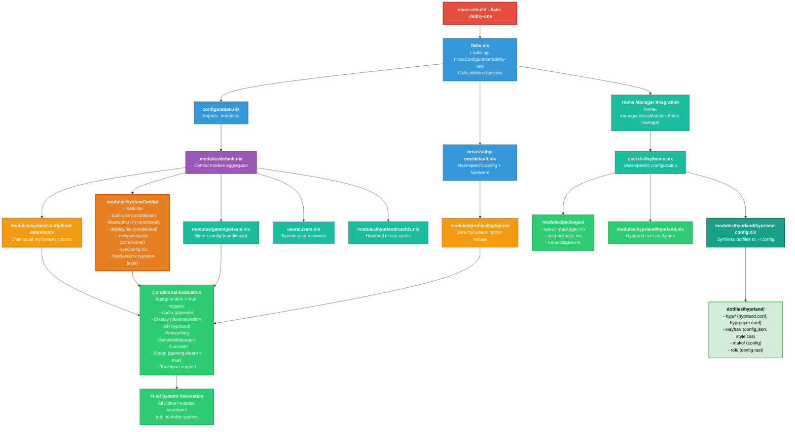

# NixOS Configuration Rebuild Flow

This document explains how the NixOS configuration is assembled and applied when you run a rebuild command.

## Quick Start: From Zero to Your Exact Setup

1. **Install NixOS** with any basic configuration
2. **Clone this repository:**
   ```bash
   git clone https://github.com/sithypenguin/nix-config.git ~/Development/nixos/nix-config
   cd ~/Development/nixos/nix-config
   ```
3. **Apply the configuration:**
   ```bash
   sudo nixos-rebuild switch --flake .#sithy-one
   ```
4. **Log out and select Hyprland** (or Plasma6) from your display manager
5. **Done!** Everything is configured exactly as shown in this repo

## Configuration Flow Diagram



## Detailed Execution Path

### 1. Flake Discovery & Parsing
```bash
sudo nixos-rebuild switch --flake .#sithy-one
```

- NixOS looks for `flake.nix` in the current directory
- Parses the flake and looks for `nixosConfigurations.sithy-one`
- Calls the `mkHost` function with `{ hostname = "sithy-one"; }`

### 2. System Config Assembly

The `mkHost` function builds the module list in this order:

```nix
modules = [
    ./configuration.nix                          # ← First
    ./hosts/sithy-one                            # ← Second  
    home-manager.nixosModules.home-manager       # ← Third
    { home-manager config }                      # ← Fourth
]
```

### 3. Module Import Chain

#### 3a. configuration.nix
```nix
imports = [ ./modules ];
```

#### 3b. modules/default.nix
```nix
imports = [
    ./systemConfig/fonts.nix          # ← Fonts loaded
    ./systemConfig/audio.nix          # ← Audio config loaded (conditional)
    ./systemConfig/bluetooth.nix      # ← Bluetooth config loaded (conditional)
    ./systemConfig/display.nix        # ← Display config loaded (conditional)
    ./systemConfig/host-options.nix   # ← OPTIONS DEFINED HERE
    ./systemConfig/networking.nix     # ← Networking config loaded (conditional)
    ./systemConfig/sysConfig.nix      # ← Basic system config loaded
    ./hyprland/cachix.nix             # ← Hyprland binary cache
    ./systemConfig/hyprland.nix       # ← Hyprland system-level config
    ./gaming/steam.nix                # ← Gaming config loaded (conditional)
    ../users/users.nix                # ← User accounts loaded
];
```

#### 3c. hosts/sithy-one/default.nix
```nix
imports = [
    ./hardware-configuration.nix        # ← Hardware detection
    ../../modules/profiles/laptop.nix   # ← Profile configuration
];
networking.hostName = "sithy-one";      # ← Hostname set
```

#### 3d. modules/profiles/laptop.nix
```nix
mySystem = {
    laptop.enable = true;
    laptop.environment = "plasma6";  # or "hyprland"
    gaming.enable = true;
    gaming.steam = true;
    development.enable = true;
    hardware.bluetooth = true;
};
```

### 4. Conditional Module Evaluation

NixOS evaluates all conditional logic based on `mySystem` options:

#### Audio Module (audio.nix)
```nix
config = lib.mkIf (config.mySystem.laptop.enable) {  # ← TRUE, so activates
    security.rtkit.enable = true;
    services.pipewire = { ... };
};
```

#### Display Module (display.nix)
```nix
config = lib.mkIf (config.mySystem.laptop.enable || config.mySystem.desktop.enable) {  # ← TRUE
    services.xserver.enable = true;
    services.displayManager.sddm.enable = true;      # ← Enabled for both
    services.desktopManager.plasma6.enable = true;   # ← Plasma6 (when selected)
    services.libinput.enable = true;                 # ← Touchpad for laptop
};
```

#### Bluetooth Module (bluetooth.nix)
```nix
config = lib.mkIf config.mySystem.hardware.bluetooth {  # ← TRUE, so activates
    hardware.bluetooth.enable = true;
    hardware.bluetooth.powerOnBoot = true;
};
```

#### Steam Module (steam.nix)
```nix
config = lib.mkIf config.mySystem.gaming.steam {  # ← TRUE, so activates
    programs.steam.enable = true;
};
```

#### Hyprland System Module (systemConfig/hyprland.nix)
```nix
programs.hyprland = {
    enable = true;
    package = pkgs-unstable.hyprland;
};
```

### 5. Home Manager Integration

```nix
home-manager.users.sithy = import ./users/sithy/home.nix;
```

#### Home Manager Module Chain (home.nix)
```nix
imports = [
    ../../modules/packages/sys-util-packages.nix    # ← User packages loaded
    ../../modules/packages/gui-packages.nix         # ← GUI packages loaded  
    ../../modules/packages/tui-packages.nix         # ← TUI packages loaded
    ../../modules/hyprland/hyprland.nix             # ← Hyprland user packages
    ../../modules/hyprland/hyprland-config.nix      # ← Dotfiles symlinked
];
```

#### Hyprland User Packages (hyprland.nix)
Installs Hyprland-specific applications:
- mako (notifications)
- waybar (status bar)
- hyprpaper (wallpaper)
- rofi (app launcher)
- And more...

Also enables `services.hyprpolkitagent.enable = true` for authentication dialogs.

#### Dotfiles Management (hyprland-config.nix)
Creates symlinks from `dotfiles/` to `~/.config/`:

```nix
home.file.".config/hypr/hyprland.conf".source = ../../dotfiles/hyprland/hypr/hyprland.conf;
home.file.".config/waybar/config.json".source = ../../dotfiles/hyprland/waybar/config.json;
# ... and more
```

**Result:** Your config files in `~/.config/` become read-only symlinks to the Nix store, which are copies of files from `dotfiles/hyprland/`.

### 6. Final System Generation

NixOS combines all active configurations:

**Always Active:**
- Fonts (FiraCode Nerd Font, etc.)
- Basic system config (bootloader, timezone, locale)
- User accounts
- Hyprland binary cache

**Conditionally Active:**
- Audio (pipewire) - triggered by `laptop.enable`
- Display (Plasma6/SDDM or Hyprland) - based on `laptop.environment`
- Networking (NetworkManager) - triggered by `laptop.enable`
- Bluetooth - triggered by `hardware.bluetooth`
- Steam - triggered by `gaming.steam`
- Touchpad support - triggered by `laptop.enable`

**User Packages:**
- System utilities (git, btop, fastfetch, etc.)
- GUI applications (Firefox, VSCode, Bitwarden, etc.)
- TUI tools (ncspot)
- Hyprland ecosystem (waybar, rofi, mako, etc.)

**Dotfiles (Nix-managed):**
- Hyprland config with Solar System theme
- Waybar with gradient from warm (sun) to cool (space)
- Mako notifications
- Rofi app launcher

### 7. Build & Activation

1. **Evaluation:** All Nix expressions evaluated to determine what needs to be built
2. **Building:** Missing packages downloaded/compiled
3. **Generation:** New system generation created in `/nix/store/`
4. **Symlink Creation:** Home Manager creates symlinks from `~/.config/` to store paths
5. **Switching:**
   - Bootloader updated
   - Services stopped/started as needed
   - New configuration activated
   - Dotfiles symlinked (read-only in `~/.config/`)

## Making Changes

### System-Level Changes
```bash
# Edit any file under modules/ or hosts/
nano modules/profiles/laptop.nix

# Apply changes
sudo nixos-rebuild switch --flake .#sithy-one
```

### User-Level Changes (Faster)
```bash
# Edit package lists or home config
nano modules/packages/gui-packages.nix

# Rebuild only Home Manager (faster, no system generation)
home-manager switch --flake .#sithy@sithy-one
```

### Dotfile Changes
```bash
# Edit dotfiles in the repo
nano dotfiles/hyprland/waybar/config.json

# Apply changes (Home Manager only)
home-manager switch --flake .#sithy@sithy-one

# Or full rebuild
sudo nixos-rebuild switch --flake .#sithy-one
```

**Important:** Files in `~/.config/` are now **read-only symlinks**. Always edit the source files in `dotfiles/hyprland/`.

## What Makes This Reproducible

1. **Flake lock** (`flake.lock`) pins exact versions of nixpkgs and home-manager
2. **Declarative config** - everything is defined in `.nix` files
3. **Dotfiles in repo** - your Hyprland/Waybar/Rofi configs are version-controlled
4. **No manual steps** - one command sets up everything
5. **Hardware-independent** (mostly) - only `hardware-configuration.nix` is machine-specific

## Directory Structure

```
nix-config/
├── flake.nix                    # Entry point
├── flake.lock                   # Version lock file
├── configuration.nix            # Main system config
├── dotfiles/                    # ← Your actual config files
│   └── hyprland/
│       ├── hypr/
│       │   ├── hyprland.conf
│       │   └── hyprpaper.conf
│       ├── waybar/
│       │   ├── config.json
│       │   └── style.css
│       ├── mako/
│       │   └── config
│       └── rofi/
│           └── config.rasi
├── hosts/
│   └── sithy-one/
│       ├── default.nix          # Host-specific config
│       └── hardware-configuration.nix
├── modules/
│   ├── default.nix              # Module aggregator
│   ├── systemConfig/            # System-level configs
│   │   ├── host-options.nix     # Option definitions
│   │   ├── fonts.nix
│   │   ├── audio.nix
│   │   ├── bluetooth.nix
│   │   ├── display.nix
│   │   ├── networking.nix
│   │   ├── sysConfig.nix
│   │   └── hyprland.nix
│   ├── hyprland/                # Hyprland-specific
│   │   ├── cachix.nix
│   │   ├── hyprland.nix         # User packages
│   │   └── hyprland-config.nix  # Dotfile symlinks
│   ├── gaming/
│   │   └── steam.nix
│   ├── packages/                # User packages
│   │   ├── sys-util-packages.nix
│   │   ├── gui-packages.nix
│   │   └── tui-packages.nix
│   └── profiles/
│       └── laptop.nix           # Profile options
└── users/
    ├── users.nix                # System user accounts
    └── sithy/
        └── home.nix             # Home Manager config
```

## Customization for Your Setup

To adapt this configuration:

1. **Change hostname:** Edit `hosts/sithy-one/` → `hosts/your-hostname/`
2. **Update flake.nix:** Change `sithy-one` references to your hostname
3. **Generate hardware config:** `nixos-generate-config --show-hardware-config > hosts/your-hostname/hardware-configuration.nix`
4. **Adjust profile:** Edit `modules/profiles/laptop.nix` (or create `desktop.nix`)
5. **Choose environment:** Set `laptop.environment` to `"plasma6"` or `"hyprland"`
6. **Customize dotfiles:** Edit files in `dotfiles/hyprland/` to match your preferences
7. **Add/remove packages:** Edit files in `modules/packages/`
8. **Rebuild:** `sudo nixos-rebuild switch --flake .#your-hostname`

That's it! You now have a fully reproducible NixOS configuration with all your dotfiles managed by Nix.