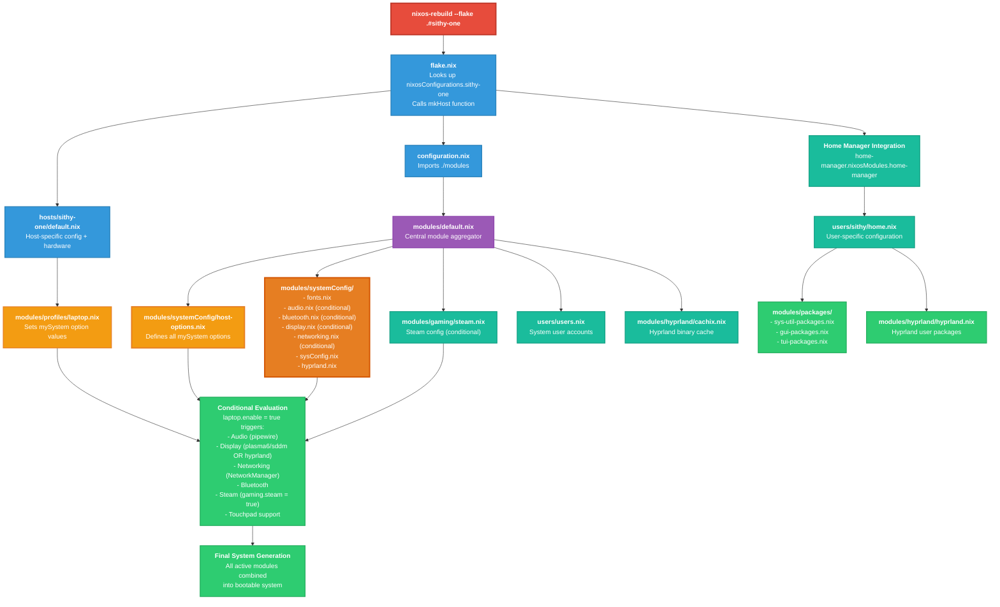

```mermaid
flowchart TD
    A["`**nixos-rebuild --flake .#sithy-one**`"] --> B["`**flake.nix**
    Looks up nixosConfigurations.sithy-one
    Calls mkHost function`"]
    
    B --> C["`**configuration.nix**
    Imports ./modules`"]
    
    B --> D["`**hosts/sithy-one/default.nix**
    Host-specific config + hardware`"]
    
    C --> E["`**modules/default.nix**
    Central module aggregator`"]
    
    D --> F["`**modules/profiles/laptop.nix**
    Sets mySystem option values`"]
    
    E --> G["`**modules/systemConfig/host-options.nix**
    Defines all mySystem options`"]
    
    E --> H["`**modules/systemConfig/**
    - fonts.nix
    - audio.nix (conditional)
    - bluetooth.nix (conditional)
    - display.nix (conditional)
    - networking.nix (conditional)
    - sysConfig.nix
    - hyprland.nix`"]
    
    E --> I["`**modules/gaming/steam.nix**
    Steam config (conditional)`"]
    
    E --> J["`**users/users.nix**
    System user accounts`"]
    
    E --> K1["`**modules/hyprland/cachix.nix**
    Hyprland binary cache`"]
    
    B --> K["`**Home Manager Integration**
    home-manager.nixosModules.home-manager`"]
    
    K --> L["`**users/sithy/home.nix**
    User-specific configuration`"]
    
    L --> M["`**modules/packages/**
    - sys-util-packages.nix
    - gui-packages.nix
    - tui-packages.nix`"]
    
    L --> N1["`**modules/hyprland/hyprland.nix**
    Hyprland user packages`"]
    
    F --> N["`**Conditional Evaluation**
    laptop.enable = true triggers:
    - Audio (pipewire)
    - Display (plasma6/sddm OR hyprland)
    - Networking (NetworkManager)
    - Bluetooth
    - Steam (gaming.steam = true)
    - Touchpad support`"]
    
    G --> N
    H --> N
    I --> N
    
    N --> O["`**Final System Generation**
    All active modules combined
    into bootable system`"]
    
    %% Color styling for better visibility
    style A fill:#e74c3c,stroke:#c0392b,stroke-width:3px,color:#fff
    style B fill:#3498db,stroke:#2980b9,stroke-width:2px,color:#fff
    style C fill:#3498db,stroke:#2980b9,stroke-width:2px,color:#fff
    style D fill:#3498db,stroke:#2980b9,stroke-width:2px,color:#fff
    style E fill:#9b59b6,stroke:#8e44ad,stroke-width:2px,color:#fff
    style F fill:#f39c12,stroke:#e67e22,stroke-width:2px,color:#fff
    style G fill:#f39c12,stroke:#e67e22,stroke-width:3px,color:#fff
    style H fill:#e67e22,stroke:#d35400,stroke-width:3px,color:#fff
    style I fill:#1abc9c,stroke:#16a085,stroke-width:2px,color:#fff
    style J fill:#1abc9c,stroke:#16a085,stroke-width:2px,color:#fff
    style K fill:#1abc9c,stroke:#16a085,stroke-width:2px,color:#fff
    style K1 fill:#1abc9c,stroke:#16a085,stroke-width:2px,color:#fff
    style L fill:#1abc9c,stroke:#16a085,stroke-width:2px,color:#fff
    style M fill:#2ecc71,stroke:#27ae60,stroke-width:2px,color:#fff
    style N fill:#2ecc71,stroke:#27ae60,stroke-width:2px,color:#fff
    style N1 fill:#2ecc71,stroke:#27ae60,stroke-width:2px,color:#fff
    style O fill:#2ecc71,stroke:#27ae60,stroke-width:2px,color:#fff

```