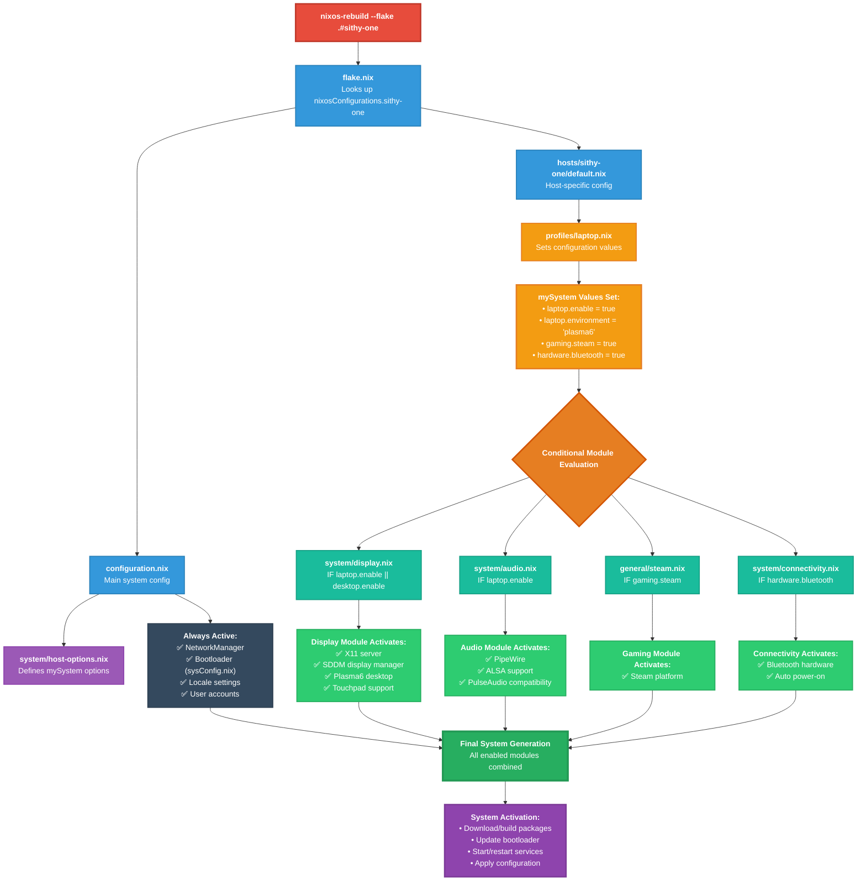

```mermaid
flowchart TD
    A["`**nixos-rebuild --flake .#sithy-one**`"] --> B["`**flake.nix**
    Looks up nixosConfigurations.sithy-one`"]
    
    B --> C["`**configuration.nix**
    Main system config`"]
    
    B --> D["`**hosts/sithy-one/default.nix**
    Host-specific config`"]
    
    C --> E["`**system/host-options.nix**
    Defines mySystem options`"]
    
    D --> F["`**profiles/laptop.nix**
    Sets configuration values`"]
    
    F --> G["`**mySystem Values Set:**
    • laptop.enable = true
    • laptop.environment = 'plasma6'
    • gaming.steam = true
    • hardware.bluetooth = true`"]
    
    G --> H{"`**Conditional Module Evaluation**`"}
    
    H --> I["`**system/display.nix**
    IF laptop.enable || desktop.enable`"]
    
    H --> J["`**system/audio.nix**
    IF laptop.enable`"]
    
    H --> K["`**general/steam.nix**
    IF gaming.steam`"]
    
    H --> L["`**system/connectivity.nix**
    IF hardware.bluetooth`"]
    
    I --> M["`**Display Module Activates:**
    ✅ X11 server
    ✅ SDDM display manager
    ✅ Plasma6 desktop
    ✅ Touchpad support`"]
    
    J --> N["`**Audio Module Activates:**
    ✅ PipeWire
    ✅ ALSA support
    ✅ PulseAudio compatibility`"]
    
    K --> O["`**Gaming Module Activates:**
    ✅ Steam platform`"]
    
    L --> P["`**Connectivity Activates:**
    ✅ Bluetooth hardware
    ✅ Auto power-on`"]
    
    C --> Q["`**Always Active:**
    ✅ NetworkManager
    ✅ Bootloader (sysConfig.nix)
    ✅ Locale settings
    ✅ User accounts`"]
    
    M --> R["`**Final System Generation**
    All enabled modules combined`"]
    N --> R
    O --> R
    P --> R
    Q --> R
    
    R --> S["`**System Activation:**
    • Download/build packages
    • Update bootloader
    • Start/restart services
    • Apply configuration`"]
    
    %% Color styling for better visibility
    style A fill:#e74c3c,stroke:#c0392b,stroke-width:3px,color:#fff
    style B fill:#3498db,stroke:#2980b9,stroke-width:2px,color:#fff
    style C fill:#3498db,stroke:#2980b9,stroke-width:2px,color:#fff
    style D fill:#3498db,stroke:#2980b9,stroke-width:2px,color:#fff
    style E fill:#9b59b6,stroke:#8e44ad,stroke-width:2px,color:#fff
    style F fill:#f39c12,stroke:#e67e22,stroke-width:2px,color:#fff
    style G fill:#f39c12,stroke:#e67e22,stroke-width:3px,color:#fff
    style H fill:#e67e22,stroke:#d35400,stroke-width:3px,color:#fff
    style I fill:#1abc9c,stroke:#16a085,stroke-width:2px,color:#fff
    style J fill:#1abc9c,stroke:#16a085,stroke-width:2px,color:#fff
    style K fill:#1abc9c,stroke:#16a085,stroke-width:2px,color:#fff
    style L fill:#1abc9c,stroke:#16a085,stroke-width:2px,color:#fff
    style M fill:#2ecc71,stroke:#27ae60,stroke-width:2px,color:#fff
    style N fill:#2ecc71,stroke:#27ae60,stroke-width:2px,color:#fff
    style O fill:#2ecc71,stroke:#27ae60,stroke-width:2px,color:#fff
    style P fill:#2ecc71,stroke:#27ae60,stroke-width:2px,color:#fff
    style Q fill:#34495e,stroke:#2c3e50,stroke-width:2px,color:#fff
    style R fill:#27ae60,stroke:#229954,stroke-width:4px,color:#fff
    style S fill:#8e44ad,stroke:#7d3c98,stroke-width:3px,color:#fff
```